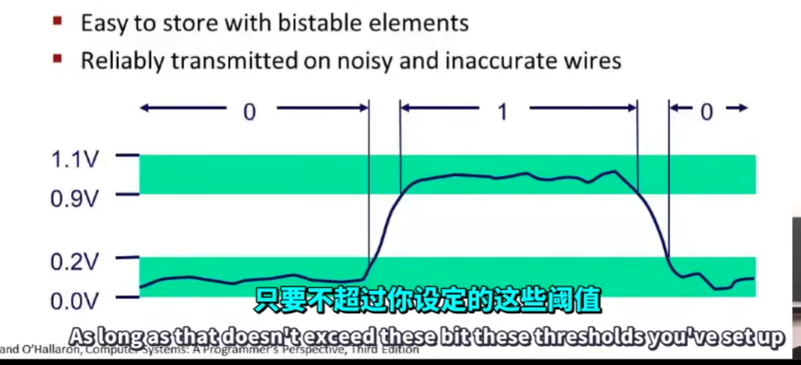

# Bits, Bytes, and Integers

## why use bits

* it's easy to store with bistable elements
* reliably transmitted on noisy and inaccurate wires



在计算机中, 如何利用bit 表示整数

二进制, 十进制, 十六进制的转换

| hex-decimal | decimal | binary |   
| ----------- | ------- | ------ |    
| F           | 15      | 1111   |   
| E           | 14      | 1110   |
| D           | 13      | 1101   |
| C           | 12      | 1100   |
| B           | 11      | 1011   |
| A           | 10      | 1010   |
| 9           | 9       | 1001   |
| 8           | 8       | 1000   |
| 7           | 7       | 0111   |
| 6           | 6       | 0110   |
| 5           | 5       | 0101   |
| 4           | 4       | 0100   |
| 3           | 3       | 0011   |
| 2           | 2       | 0010   |
| 1           | 1       | 0001   |
| 0           | 0       | 0000   |

一般而言 1 Byte = 8 bits


Boolean Algebra

And(&), Or(|), Not(~), Exclusive-Or(Xor)(^)

位运算与集合很相似, 与运行相等于求交集, 或运算相当于求并集, 异或相当于求对称差集, 非运算相当于求补集

逻辑运算:&& /|| /!

移位运算 >>, << 
	算数右移: 考虑符号位, 右移填充均为与符号位相同的数字
	逻辑右移: 不考虑符号位, 直接将符号位一同右移

>在某些机器的C语言中, 移位指令只需要考虑移位量的低 $\log_{2}{(\text{sizeof type})}$ 即可, 所以对一个byte 左移八位, **可能** 得到的是原数的 mod 8结果

数字的表示

无符号整数

$$ B2U(X) = \sum\limits_{i=0}^{w-1}x_{i}\cdot 2^{i}$$

带符号整数的补码!

$$B2T(X) = -x_{w-1} \cdot 2^{w-1} + \sum\limits_{i=0}^{w-2}x_{i} \cdot 2^{i}$$

其中 $x_{w-1}$ 位代表最高位, 如果是无符号数就是正数, 那直接相加即可, 如果是带符号数, 就变成**负数**, 而其余位仍为**正数**, 相加结果就是带符号数的**补码**
`two's complement` 补码
## 无符号数与带符号数的区间范围

无符号数 : $0 \to 2^{w}-1$  \
带符号数: $-2^{w-1} \to 2^{w-1} -1$ 

## 无符号与带符号数的关系


无符号数和补码可以相互转换,且这种转换是一一对应的!可以看作是一种函数关系


## 无符号与带符号数的运算:

1. 如果均为带符号,则结果为带符号数
2. 如果其中一个为无符号,则结果为无符号,且在运算中会将带符号转换为无符号数


一个有意思的内容
```c
if(x < 0)
{
	return  -x;
}
else
{
	return x;
}
```
当输入为 Tmin 输入仍为 Tmin, 
因为 $|T_{max}|= |T_{min}|-1$ ,所以负数取绝对值后会溢出, 也即 $T_{max}+ 1$ 根据上面带符号与无符号的映射表可知, 最终仍然是 $T_{min}$  

## 带符号数的拓展


将前面的所有位都扩展为符号位, 后面的位不变

## 二进制截断

无符号数: 保留几位, 就对原数进行 $\pmod {2^{n}}$ 运算 
带符号数: 数值不确定

## 整数的运算

### 无符号数的加法

直接相加, 如果溢出则不考虑溢出位, 也即 $\text{UAdd}_{w}(u, v) = (u + v) \pmod{2^{w}}$  , w是最高位的位数

### 有符号的相加

就是简单的补码相加, 得到的补码就是结果的补码, 但是在补码溢出时, 会得到错误的结果

如果结果大于正数的最大值, 则溢出为负数, 反之, 溢出为正数

## 乘法


### 无符号数的乘法


忽略高w位, 只保留低 w位

### 带符号数(补码)的乘法


## 2 的幂次

左移乘2, 右移除2

## 对一个数取负

反转所有的位+1 

注意: 反码不改变符号位, 取负要改变符号位


## 无符号数的一个小技巧


## 内存的一种看法


## 内存的划分


## 字节对齐

大端对齐: 互联网一般使用大端对齐进行字节传输

小端对齐: 常见的cpu: arm, x86 都是小端对齐的


## 字符串


   