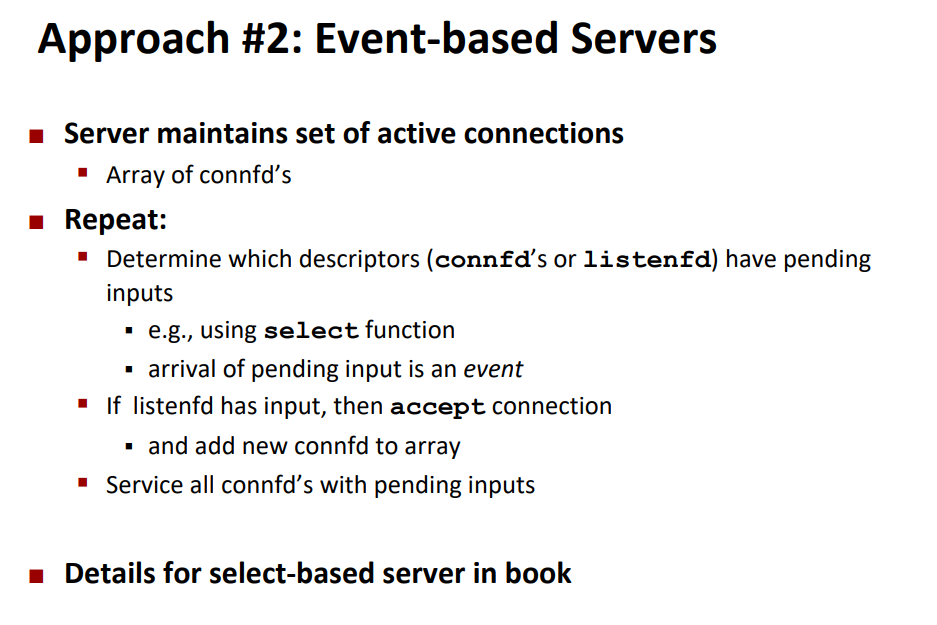
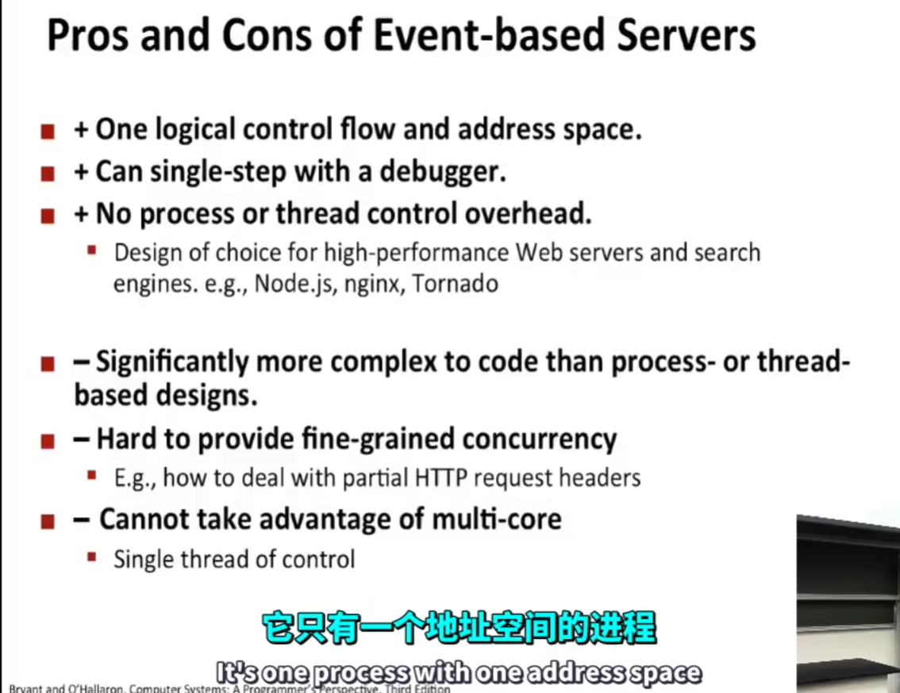
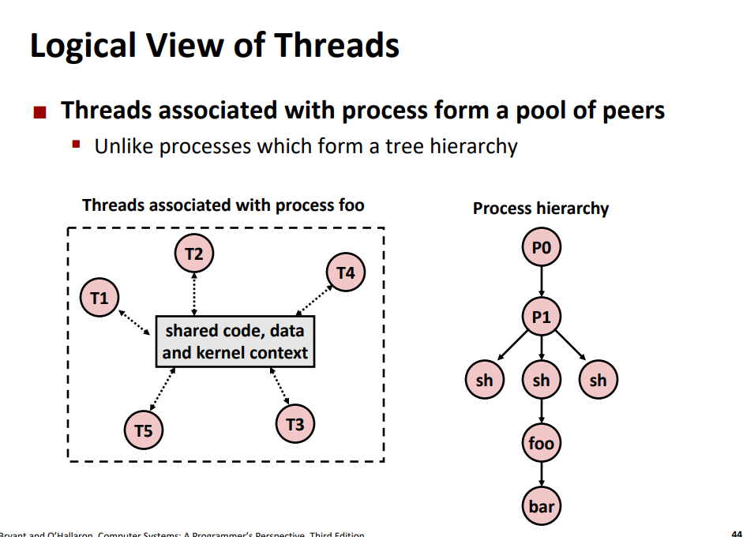

# 并发编程的问题
1. 竞争关系
2. 死锁
3. 活锁，饥饿，公平

网络服务器实际上是需要并发的， 如图所示， 如果两个客户端向服务器进行通信，同时只有一个客户端可以占用服务器资源，另一个客户端只能等待。

值得注意的是第二个客户端是在哪一步阻塞的！

1. 连接不会阻塞，即使连接还没有被接受，也已经向服务器发送了请求
2. 写入不会阻塞，写入是将数据写入到缓冲队列中
3. 读入开始堵塞，客户端需要等待服务器写入才可以读取
4. 服务器在处理完第一个客户端后才会接收第二个客户端的信息

# 实现并发的方式：
1. 基于进程
2. 基于事件
3. 基于线程

## 基于进程

有几点需要注意：
1. 必须防止僵尸进程的出现，主进程需要回收子进程的资源
2. 父进程需要关闭连接套接字，因为在进行fork后，套接字的引用计数增加到了2，只有引用计数为0才会真正关闭

## 基于事件

## 基于线程

线程之间除了栈以外，其余部分都是共享的！

与线程的fork创建不同，线程可以看作池， 相互关联到一起

线程在同一段时间内共同进行，可以认为线程是并发的

## 线程和进程的关系

## 线程的创建

**detached 模式**，线程独立运行于其他线程，可以自动被回收。但是与其他线程分离了（如主线程），就不能被其他线程影响（比如杀死）

注意共享资源的使用！

正确方法，在主线程中创建指针，在子线程中释放指针

## 线程的优缺点

