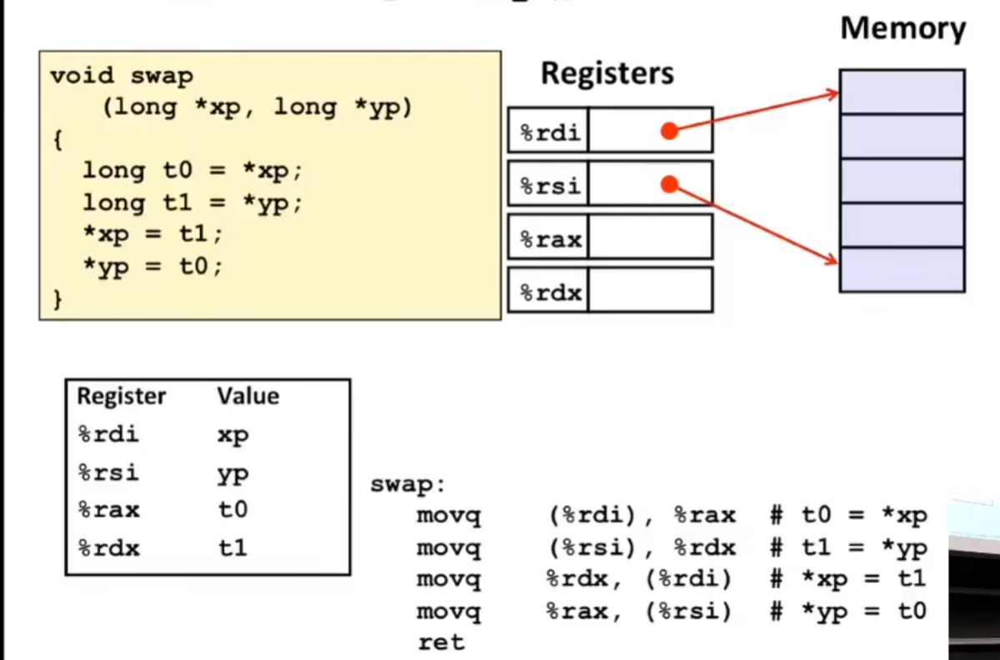
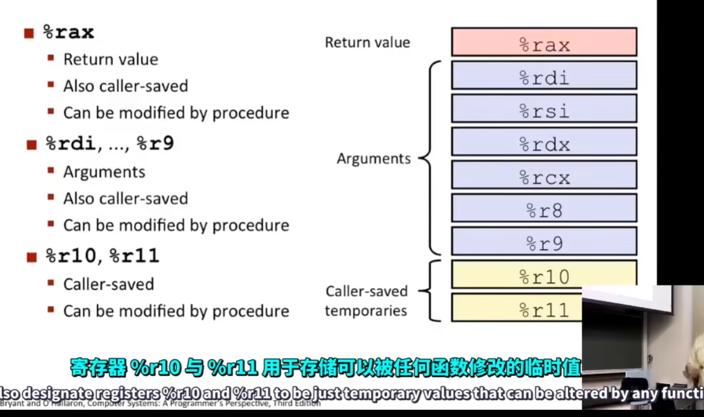
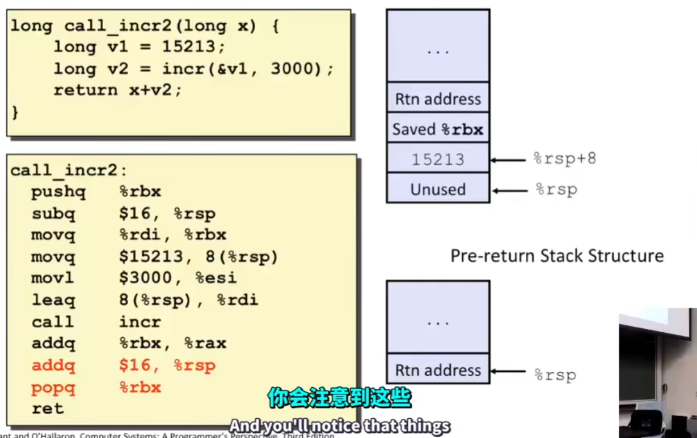

# Basics

## 架构

架构是用来理解或者书写 `汇编` 或 `机器` 代码的一种设计

## 汇编/机器 代码的一种视图


## 汇编基础(x86-64/AT&T)

### 寄存器

```
x86-64 整数寄存器
64位寄存器              32位寄存器            16位寄存器             8位寄存器
%rax                     %eax                  %ax                   %al
%rbx                     %ebx                  ...
%rcx                     %ecx
%rdx                     %edx
%rsi                     %esi                                         %sil     
%rdi                     %edi
%rsp                     %esp
%rbp                     %ebp
%r8                      %r8d                 %r8w(word)            %r8b(byte)
%r9                      %r9d
%r10                     %r10d
%r11                     %r11d
%r12                     %r12d
%r13                     %r13d
%r14                     %r14d
%r15                     %r15d
```

**只有 ax, bx, cx, dx可以访问十六位寄存器的高八位** \ 
%e只是%r的低32位而已\
**指令后面的 q 代表 4 也即 16 * 4 = 64 位寄存器**

### Move指令

```assembly
movq source, dest
```
可以操作的数据类型:
* 立即数 Immediate 常数, 与C的常量是相同的含义,使用 $ 作为前缀 $0x400, $-533, 长度为1, 2, 4字节
* 寄存器: 十六个整数寄存器都可以,  `%rax` ,  `%r13` , 但是 `%rsp` 保留用作其他用途, 其余寄存器会在某些特殊指令中发挥特殊作用
* 内存: 由寄存器指定的8个连续字节的内存地址(**64位地址总线, 所以是64位系统**), 用 `()` 表示访问, 比如 `(%rax)` 有很多寻址模式

movq指令根据源操作数和目的操作数有多种组合,**但是不允许源操作数和目的操作数均为内存!!!**


### 内存寻址模式

#### 简单内存寻址模式

1. 一般情况-寄存器寻址: (R)  `Mem[Reg[R]]` 

 `movq (%rcx), %rax` \
寄存器 R 中表示的是特定的内存地址, 类似于 C 语言中的解引用 

2. 偏移寻址-寄存器相对寻址: D(R)  `Mem[Reg[R]+D]`

`movq 8(%rbp), %rdx` \
R 代表开始地址, D代表偏移



`%rdi` 是第一个参数寄存器, `%rsi` 是第二个参数寄存器, 最多可以有六个存储参数的寄存器

#### 复杂地址寻址模式

统一的形式 `D(Rb,Ri,S)` 代表 `Mem[Reg[Rb] + S * Reg[Ri] + D]`  \
其中
* D: 代表偏移, 可以是1, 2, 4字节长度整数
* Rb 是基址寄存器, 任意 16 个整数寄存器皆可
* Ri index寄存器, 除 `%rsp` 以外的 15 个寄存器皆可
* S 是规模, 有1, 2, 4, 8 四种选择, 一般对于一个数组的索引有帮助, int 就放大4倍, long就放大8倍

如果某些寄存器不写, 则认为其为0


### lea指令

```
leaq src, dst
src 是地址表达式
dst 表达式定义的地址结果
```

用于计算地址表达式的值, 类似于C语言中的取址运算符 `&` 比如 `int *p = &a;`

C 编译器很喜欢利用这个指令进行一些简单的运算


`leaq (%rdi, %rdi, 2), %rax` 是计算 `%rdi * 3`  
`salq $2 %rax` 是 `%rax` 算数左移2位( x4) ,最终得到了 12倍的原数

### 一些运算操作指令

```
addq  src, dst    ;  dst = dst + src
subq  src, dst    ;  dst = dst - src
imulq src, dst    ;  dst = dst * src
salq  src, dst    ;  dst = dst << src ;也可以是 shlq
sarq  src, dst    ;  dst = dst >> src ;Shift Arithmetic Right 算数右移, 复制符号位 
shrq  src, dst    ;  dst = dst >> src ;SHift logical Right 逻辑右移, 补零
xorq  src, dst    ;  dst = dst ^ src
andq  src, dst    ;  dst = dst & src
orq   src, dst    ;  dst = dst | src
========================================================================
incq  dst         ;  dst = dst + 1
decq  dst         ;  dst = dst - 1
negq  dst         ;  dst = - dst
notq  dst         ;  dst = ~ dst
```


# Control

## %rsp

`%rsp` 栈基址寄存器, 存储栈的地址, 其对应于一个寄存器 `%rip` 指令寄存器 `(instructions pointer)` 用于指向程序的执行位置.

## status flags

`%rflags` 状态寄存器, 保留运算结果的状态, 状态寄存器的状态码, 常用的一些状态码: 
* CF 无符号进位状态位
* SF 补码进位状态位
* ZF 零状态位
* OF 补码溢出寄存器 (最高位与次高位进位的异或)


`lea` 不会影响以上四个状态码

```
cmpq src2, src1        ;  src1 - src2
```
`cmpq` 做减法操作, 但是不会赋值

```
testq src2, src1       ;  src1 & src2
```
`testq` 做与运算, 但是不会赋值


上表中显示的时常用的setX指令, SetX指令返回状态码到指定的 **8** 位寄存器中, 而setx只会写入 **1** 位, 其余 **7** 位不要修改

```
setx %al
```

将状态码放入到 `%al` 寄存器中

```
movzbl %ax, %rax     ;  move 8-bit data from 8-bit register to 64-bit register
```

## jx instructions(old style)


`-fn-if-conversion` 不要使用conditional moves \
在 C 语言中 `goto` 可以实现类似功能

## Conditional Moves(more fashion than Jx)


`cmovx` 在 C 语言中可以用 `condition ? a: b;` 近似表示

## Loop

`do while` 的一种汇编表示方法, 以某个函数为例


```
do:
	body
	if (test) goto do;
```

`while` 的实现方式(以goto 代表跳转)

1. 方法1:


```
	goto test;
loop:
	body:
test:
	if(test) goto loop;
done:
```

2. 方法2: 将`while` 转换为 `do while`


`for loop` 的实现形式


## switch 

switch 使用了跳转表结构, 通过查表寻找应该执行的语句


 

`ja .L8` 是 unsigned 运算, 如果一个数为负数, 则转变很大的正数, 直接进入 default, 当然对于原本就大于 6 的数字也会跳转到 default. 因此不使用 `jg`

`jmp *.L4(, %rdi, 8)*` 是switch的关键运算


# Procedures

## stack


**实际上, 栈底在高位地址, 栈顶在低位地址, 栈是向下生长的**, `%rsp` 指向的就是栈顶的地址 

具体而言存在两个栈的运算符
```
pushq src  ; 将 src 送入栈中, 栈顶向下偏移 8 (64 / 8 = 8)
popq dest  ; 将数据从栈中送入 dest, 栈顶向上偏移 8 
```

## Control Flow

`call` and `ret` 是过程控制的两个指令, `call` 用于调用过程, `ret` 用于从过程返回

```
callq 400550 ; %rip = 400550
retq 
```

### call

`call` 会做三件事:
 1. 减少栈指针, 将栈指针向下偏移 8
 2. 将调用 `call` 的下一条指令的地址压入栈中
 3. 将过程的地址送入 `%rip` 中

### ret

`ret` 会从栈中弹出 `call` 压入栈中的地址, 并将栈指针增加


## Passing data

根据 `ABI(application binary interface)` 规定, 调用 `call` 的前 6 个参数要使用 6 个特定的寄存器
```
%rdi = arg0, %rsi = arg1, %rdx = arg2
%rcx = arg3, %r8 = arg4,  %r9 = arg5
````

如果超过六个参数, 其余参数要压入栈中, 且越靠前的参数会压入越靠前

程序的返回值保存在 `%rax` 寄存器中

**以上都是对 整数 或者 指针类型 而言, 对于浮点数有其他的寄存器进行使用**


## local data

### frame

**栈帧:** 栈上的内存分配称为栈帧, (栈上用于特定 `call` 分配的内存块), 栈帧指向分配空间的最后地址

栈帧使用的寄存器是 `%rbp` , 但是通常情况下不会使用, 所以 `%bsp` 一般就作为普通寄存器使用  


### register saving conventions

一般有两种 `caller save` 和 `callee save` , `caller save` 是调用前进行保护,  `callee save` 是调用后进行保护






## recursion


# Data

## array


对机器代码, 访问数组可以采用高级寻址模式进行
```
movl (%rdi, %rsi, 4), %eax  ; %eax = (%rdi + 4 * %rsi)
```


### understand pointers and arrats

1. 在声明一个数组时, 既是在分配空间, 也建立了一个指针; 声明一个指针时, 没有分配其他空间, 只分配了指针本身的空间
```c
int A1[3]; // sizeof(A1) = 12
int *A2;   // sizeof(A2) = 4/8 不同的编译器对指针的大小有不同的解释
```


指针数组和数组指针

```c
int A1[3]; // A1 is an array store 3 int
int *A2[3]; // A2 is an array store 3 (int *) pointer
int (*A3)[3]; // A3 is a pointer point to an array
```


```c
int (*A4[3]); // A4 is an array of 3 elements which are pointers to int, the same as A2
```

### multidimensional array


## structure


 **结构体对齐**


## 浮点表示

寄存器
```
每个寄存器都是 128 位宽 (16 字节) 的
%xmm0
%xmm1
...
%xmm15
```

指令
```
addss %xmm0, %xmm1  ; scalar single, 单组相加
addps %xmm0, %xmm1  ; 多组相加, 并行计算
addsd %0, %1 ; 双精度数单组相加
...

instruction_s_s : 对单精度浮点数进行单组运算
instruction_p_s : 对单精度浮点数进行多组运算
instruction_s_d : 对多精度浮点数进行单组运算
instruction_p_d : 对多精度浮点数进行多组运算
```


# Advanced Topics

## memory layout


## buffer overflow(缓冲溢出/数组越界)

!! **二进制注入攻击**

1. 使用更安全的函数
2. 设置随机栈偏移
3. 不可执行代码段
4. 栈保护: gcc -fstack-protector(now is default)

## Union


