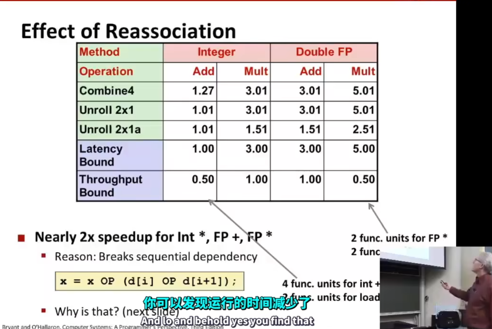

# 一些常用的优化方法

## 代码移动

减少计算的频率: 如果一个表达式总是具有相同的结果时, 可以考虑将其脱离循环语句

这里的 `n * i` 就是一个例子, 可以将其脱离循环语句, 作为单独的语句进行计算

## 减少计算复杂度

1. 减少更多消耗的运算
2. 使用移位运算, 加法运算进行乘法和除法的计算

## 共享相同的子表达式

## 一些例子

多次访问内存, 速度会相对变慢, 可以考虑使用局部变量, 只进行一次赋值

编译器会考虑出现 `a, b` 数组重叠的问题, 所以每次都会访问内存, 而使用局部变量则只在寄存器中进行运算, 所以不会访问很多次内存

# 硬件本身可以使程序得到优化

CPU并不完全按照书写的代码顺序进行指令执行, 而是对指令进行分解, 将不依赖的指令同时执行, 以提升程序的执行速度. (**乱序执行**)

## 流水线技术:

## 循环展开(没咋看懂呢)

不同的循环展开方式会导致速度发生变化

还可以采用这种展开方式

## AVX并行计算

