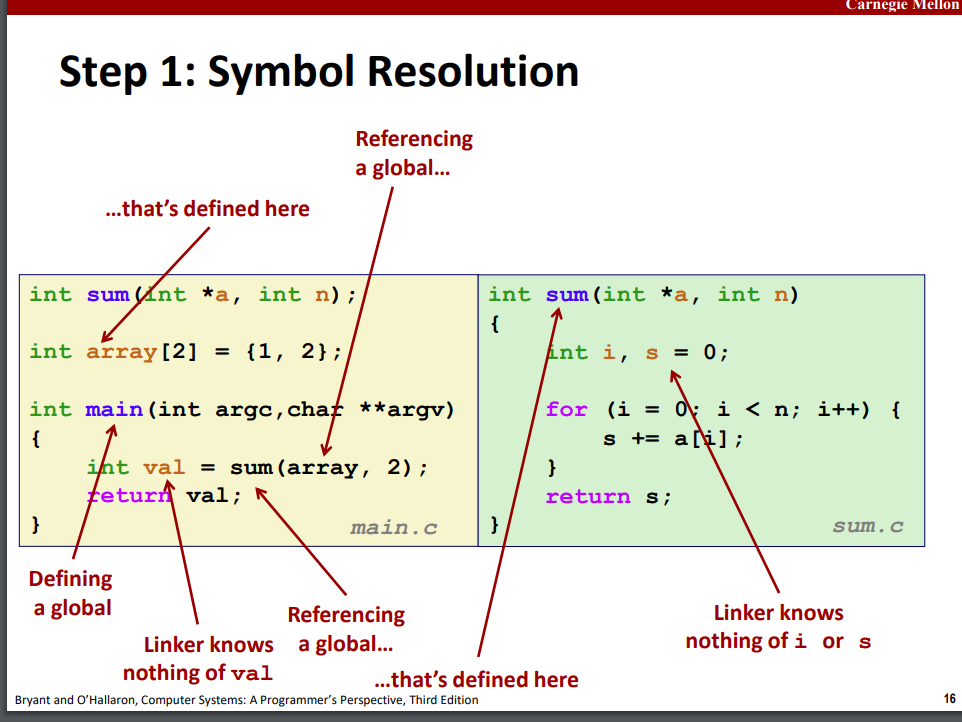

# static linking


## 为什么要进行连接? 
1. 模块化处理, 缩小代码的规模, 使得代码可以很好组织
2. 提高效率, 如果把程序分成很多小块, 当某个小块修改, 只需要重新编译修改部分的小块

# 链接器会做什么?

1. 简单解析(符号解析)

链接器会解析程序中的 **符号** (全局变量/函数), 然后回将其存储在 `object` 文件中,  链接器会将每一个符号引用关联到其对应的定义上

2. 重定位

会将分离的代码和数据结构汇总到一个部分, 之后重定位到内存地址处, 最后更新所有这些符号的引用, 使其能够定位到新的位置.

# 几种目标文件


1. .o 文件是可重定向文件, 并不全是二进制形式, 也不能加载进入内存执行
2. .out文件时可执行文件, 被直接加载进入内存进行执行
3. .so文件, 一种共享文件

以上三种文件采用统一的形式 **Executable and Linkable Format (ELF)** 格式

ELF文件格式


# 链接符号

有三种链接符号: 
* 全局符号, 可以被其他模块引用的符号, 比如非静态 C 函数, 非静态全局变量
* 外部符号, 可以被某个模块引用, 但是是由其他模块定义的符号
* 局部符号, 在模块中定义的函数和变量带有 static 关键字, **局部链接符号不等于局部变量**

 **注意: 链接器只关注编译时存在的变量, 在运行时定义的局部变量, 链接器不知道, 因此也不会生成局部链接符号**




实际上, x原本是局部变量, 但是由于 static 关键字, x在编译时被送入了 .bss 或者 .data 区

由于这两个变量名字相同, 所以链接器会给这两个符号更名, 以区分他们

# 如何消解重复符号定义?

符号也具有强弱
* **强符号**是过程名或者初始化的全局变量
* **弱符号**是未初始化的全局变量

## 链接器符号规则:

1. 不允许出现多个强符号(对同一个名称)
2. 如果有一个强符号和多个弱符号, 那么选择强符号对应的引用
3. 如果有很多弱符号, 那么随机选择一个弱符号
	如果不希望规则3, 在编译时可以使用 `-fno-common` 进行处理


**!!!** 对于全局变量: 尽量避免使用, 如果一定要使用
1. 考虑是否可以使用 static 修饰, 
2. 在使用时进行初始化
3. 使用 **extern** 关键字, 如果想要在外部文件引用这个变量

# 如何重定位


 

编译器会向链接器提供这些重定位的标志, 提醒链接器这里需要进行重定位. 编译器先利用 0x0填充 edi, 在链接时进行填充


# 加载可执行文件


* read only data 直接加载进入 read-only 代码段, 无需修改
* .data 和 .bss 的数据也可以直接放入数据段

# 静态库(static libraries / .a file)

是多个 .o file 的组合


在链接时, 链接器只会选择使用到的函数(静态库中)进行链接, 其余的函数则不会进行连接


# 动态库/共享库

如果使用静态库, 那么每个调用静态库中的函数的模块(如 printf) 则在每个模块中都会复制一个原函数的副本

但是动态库可以所有的模块共享一个函数


动态库是在程序加载进入内存后才开始进行处理的.(运行时进行处理)


 链接器并没有在链接时将函数加载进入程序, 而是进行了标记. 在执行时, 通过 loader进行解析, 利用dynamic linker 进行实际的链接

**甚至**, 可以在运行时进行动态库的加载!!!


# Library Interpositioning(库打桩)

库打桩就是拦截标准库中的函数调用, 取而代之的执行自己的包装函数


`gcc -DXXXX` 是使用 `XXXX` 作为宏定义进行编译
```bash
gcc -I. -o xxx xxx.c xxx.c ... 
```
`-I` 在指定目录下优先查找头文件, 之后去其他地址查找

上面的是编译时的操作, 当然也可以在链接时进行库打桩


```bash
gcc -Wl ,
```

`-Wl` 是使用后面用空格替换所有的逗号, 然后以此参数传递给链接器

```bash
gcc -Wall -Wl, --wrap,malloc -Wl, --warp,free -o int1
```
这里 `--wrap,malloc` 意思是使用 \_\_wrap_malloc 作为 malloc 的解决方案

甚至可以在加载程序时进行打桩, 获得运行时间


`mallocp` 保存的是 real malloc  


# 额外学习

1. [库打桩的讲解1-简书](https://www.jianshu.com/p/14bbed17548d)
2. [库打桩的讲解2-知乎](https://zhuanlan.zhihu.com/p/76036630)
3. [丰富的学习资料](https://csstormq.github.io/)
4. 