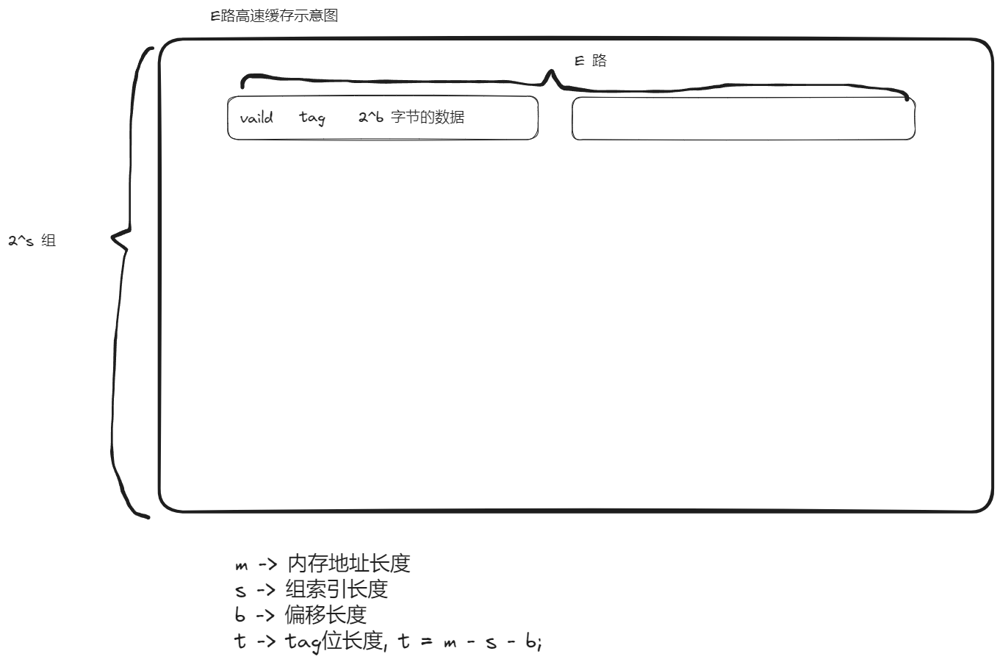
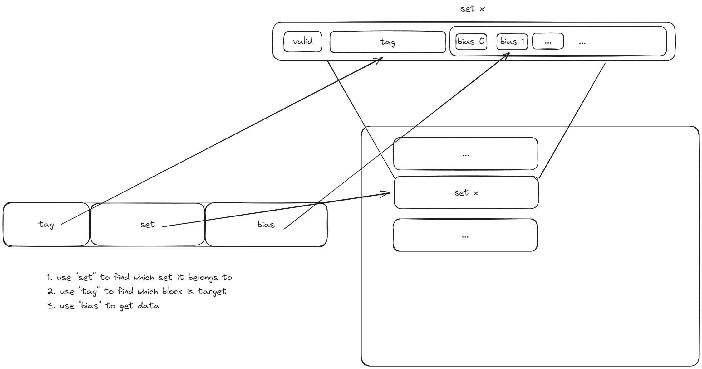

# 0. 准备

下载资源

```bash
# 程序源码
wget http://csapp.cs.cmu.edu/3e/cachelab-handout.tar
# 讲义
wget http://csapp.cs.cmu.edu/3e/cachelab.pdf
```

# 1. 基础知识

1. E路高速缓存




2. 缓存寻址



3. 缓存冲突

当set一致时,如果tag不一致,就会产生缓存冲突,这时就会进行缓存的置换运算.


