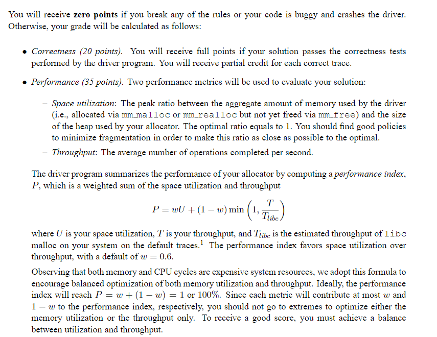
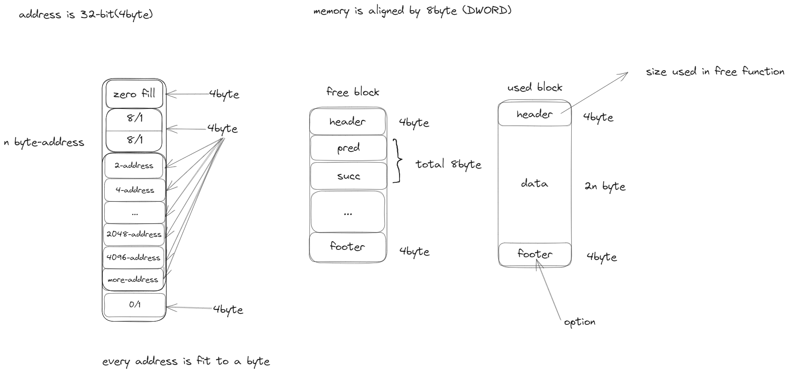

# 0. 准备

!!!实验平台是32位程序！！！

在编译中添加了选项 `-m32` 因此地址是32位地址,需要注意这点!

下载资源

```bash
# 程序源码
wget http://csapp.cs.cmu.edu/3e/malloclab-handout.tar
# 讲义
wget http://csapp.cs.cmu.edu/3e/malloclab.pdf
```
# 1. 基础知识

# 2. 实验任务

## 完成四个函数：
1. `int mm_init(void)`
2. `void *mm_malloc(size_t size)`
3. `void mm_free(void *ptr)`
4. `void *mm_realloc(void *ptr, size_t size)`

修改这些函数(或者定义其他的**静态**函数),使得他们可以遵循以下的一些情况
* mm_init:在调用其余三个函数前和一些驱动程序前,去调用mm_init去完成一些必要的初始化操作,比如分配初始化堆区域,当出错时,它的返回值应该为-1, 其余情况为0
* mm_malloc:这个函数返回一个指针指向一个被分配的内存块,这个内存块的有效内容至少为**size**字节.整个内存块应该在堆区域,并且不能于其他的分配内存块重叠
* mm_free:这个函数将ptr指向的内存进行释放,它不返回任何内容.mm_free只可以在ptr是由mm_malloc和mm_realloc函数返回的指针且当前内存还未被释放时保证正常工作.
* mm_realloc:这个函数返回一个指向最小内存为size的区域,它遵循以下几点:
	* 如果ptr是NULL, 那么这等价调用mm_malloc
	* 如果size为0, 那么这等价调用mm_free
	* 如果ptr不是NULL,那么ptr必须是由mm_malloc或mm_realloc返回的指针.调用这个函数会改变ptr指向的内存的大小,并且返回新块的地址.注意新块的地址可能等于旧块的地址,也可能不同,这取决于你的实现方式, 旧块的内存间碎片数量和realloc请求的size大小
	* 新块的内容需要与旧块的内容一致,或者到达旧块的新块的最大尺寸处(截断).其他内容都是为初始化的.例如旧块为8字节,新块为12字节,那么新块的前8字节就需要等于旧块,其余四字节就是未初始化的.同样的,旧块为8字节,新块为4字节,那么新块的前4字节就需要与旧块的前4字节完全一样

这些特性与`libc malloc realloc 和free`完全一致,详情可通过`man malloc`查看

## 了解堆一致性检查器(Heap Consistency Checker)

堆检查器一般会检查如下方面
* 每一个在free list中的内存是否被标记为free
* 是否有连续的free block以某种方式没有被合并(相邻free block需要合并)
* 是否每个free block都在free list中
* 在free list中的指针是否指向了合法的free block
* 是否存在被分配的内存块重叠问题
* 堆内存块指针是否指向了合法的堆地址

mm_check函数可以帮助debug的进行

## 支持函数(Support Routines)

memlib.c模拟了memory的系统,可以调用memlib.c中的如下函数完成任务:
* `void *mem_sbrk(int incr)`: incr是一个非零正整数, 返回指向第一个内存空间的地址.这个函数模仿sbrk函数,只不过incr只能为非零正整数
* `void *mem_heap_lo(void)`:返回heap的首地址
* `void *mem_heap_high(void)`:返回heap的尾地址
* `size_t mem_heapsize(void)`:返回heap的大小
* `size_t mem_pagesize(void)`:返回系统页的大小(4K byte 在 linux)

## 编程要求
* 不能改变mm.c的接口
* 不可以调用任何与内存管理相关的库调用或者系统调用,如malloc, calloc, free, ...
* 不允许使用任何全局或静态的组合数据结构如数组,结构体,数,链表等,但是**允许**使用全局标量变量如整数,浮点数,指针
* 返回指针必须与8 byte边界对齐

# 评估



## 提示
* 使用 `mdriver -f` 选项.在最初开发过程中,使用小的追踪检查文件会方便debug和测试,这里包括两个(short1,2-bal.rep)用于进行初期的debug
* 使用 `mdriver -v/-V` 选项.-v会显示详细的总结信息, -V也会在每个追踪文件读入时显示信息,这回帮助你找到错误
* 编译使用 `gcc -g` 这回帮你定位内存溢出的位置
* 了解书中malloc实现的每一行代码.
* 将指针运算封装在C预处理器宏中。内存管理器中的指针运算是令人困惑和容易出错的，因为所有的强制转换都是必要的。通过为指针操作编写宏，可以显著降低复杂性。参见文本中的示例
* 分阶段实施。前9个跟踪包含malloc和free的请求。最后两个跟踪包含对realloc、malloc和free的请求。我们建议您首先让malloc和free例程在前9个跟踪上正确高效地工作。只有到那时，您才应该将注意力转向realloc实现。首先，在现有malloc和free实现的基础上构建realloc。但要获得真正好的性能，您需要构建一个独立的realloc
* 使用探查器。您可能会发现gprof工具有助于优化性能。

# 3. 基本实现思路



