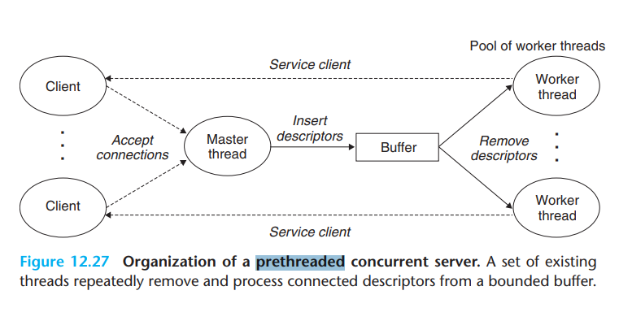

# 必须注意

**使用driver进行测试时,必须拥有root权限!**

```bash
sudo ./driver.sh
```

# 0. 准备工作

## 下载地址

1. 程序地址

```bash
wget http://csapp.cs.cmu.edu/3e/proxylab-handout.tar
```

2. 讲义地址

```bash
wget http://csapp.cs.cmu.edu/3e/proxylab.pdf
```

# 1.基础知识

## HTTP请求格式

1. GET请求:

```
GET <uri> <protocol>/<version> 
\r\n
```

例如: `GET http://www.cmu.edu/hub/index.html HTTP/1.1` 就是向域名为`http://www.cmu.edu`的服务器发送请求,获取`/hub/index.html`文件

另外需要注意的是所有的`HTTP`请求行(lines in HTTP request)都以`\r\n`结尾,而HTTP请求的终结符也是`\r\n`

2. 请求头

在这个实验中重要的请求头字段是:`Host`, `User-Agent`, `Connection`, 和`Proxy-Connection`

* Host字段:Host字段**一定**存在.host指示的是端服务器(*end server*)的主机名. 举例来说 `http://www.cmu.edu/hub/index.html` 的host就是`www.cmu.edu`, 因此代理应该存在这样的字段

`Host: www.cmu.edu`

* User-Agent字段:User-Agent字段**可以**存在

```
User-Agent: Mozilla/5.0 (X11; Linux x86_64; rv:10.0.3) Gecko/20120305 Firefox/10.0.3
```

这个字段指示的是客户端的情况(显示了操作系统和浏览器的一些参数),web server 经常使用这些信息来选择他们发生的数据。发送这个特定的User Agent:string可以在内容和多样性方面改进您在简单的telnet风格测试中获得的材料。

* Connection字段:Connection字段一定存在, 且只能为close
`
```
Connection: close
```

* Proxy-Connection字段:Proxy-Connection字段一定存在,且只能为close

```
Proxy-Connection: close
```

Connection和Proxy Connection标头用于指定在第一次请求/响应交换完成后，连接是否保持活动状态。让您的代理为每个请求打开一个新的连接是完全可以接受的（也是建议的）。将close指定为这些标头的值会提醒web服务器，您的代理打算在第一次请求/响应交换后关闭连接。

3. 端口号

对于这个实验,有两个非常重要的端口号组,HTTP请求端口和你的代理服务器监听端口.

HTTP请求端口在HTTP的URL链接中是一个可选字段,这个字段中,URL要有如下的形式 `http://www.cmu.edu:8080/hub/index.html`,这也就意味着你要通过8080端口进行通信,而传统的HTTP端口是80端口

监听端口需要从命令行中读入,如

```
linux> ./proxy 15213
```

## 线程池(prethreaded)

频繁创建和销毁线程堆操作系统而言实际上是非常消耗资源的行为,因此我们可以实现创建多个线程,而我们的任务则采用向线程池中的线程传递数据,使其指向相关的功能.



## 生产者-消费者模型

生产者消费者模型是并发编程中的一种常见模型:一个线程创造资源,另一个线程消耗资源.如何通过并发控制,使其能够正常运行?这个模型就是生产者消费者模型.

其基本实现思想如下:

```c
// 包含头文件 pthread.h, sys/types.h, unistd.h, semaphore.h 
#define MAX_OBJ_COUNT 10 // 标识最大对象数量

sem_t slots; // 标识是否有空闲位置生产对象
sem_t items; // 标识是否有以生产出的对象
sem_t mutex; // 这里也可以换成 pthread_mutex_t mutex

/*
	需要初始化信号量
	sem_init(&slots, 0, MAX_OBJ_COUNT); // 中间参数标识该信号量是否跨进程
	sem_init(&items, 0, 0); // 最开始没有对象 
	sem_init(&mutex, 0, 1); // 互斥锁 
*/
void producer()
{
	sem_wait(&slots); // 检测是否有空余位置,P运算
	// ... 生产过程 
	sem_wait(&mutex);
	// ... 修改全局变量
	sem_post(&mutex);
	// ...
	sem_post(&items); // 提醒其他线程已经生产一个对象,V运算
}

void consumer()
{
	sem_wait(&slots); // 检测是否有对象,P运算
	// ... 消费过程 
	sem_wait(&mutex);
	// ... 修改全局变量
	sem_post(&mutex);
	// ...
	sem_post(&items); // 提醒其他线程已经消耗一个对象,V运算
}
```

## 读写锁

读写锁需要控制**读写互斥, 写写互斥**

# 2. 实验任务

## 2.1 实现一个顺序网络代理(sequential web proxy)

>When started, your proxy should listen for incoming connections on a port whose number will be specified on the command line. 在开始时,你的代理需要在一个特定的端口(根据命令行的输入确定)监听即将到来的连接.

>Once a connection is established, your proxy should read the entirety of the request from the client and parse the request. 一旦一个连接建立了,你的代理需要读到这个来自客户端的请求实体,并且解析这个请求

>It should determine whether the client has sent a valid HTTP request; if so, it can then establish its own connection to the appropriate web server then request the object the client specified. 你需要决定这个客户端的请求是否是合法的,如果是的话,就可以想准确的web server建立一个连接,之后根据客户端的请求向web server获取特定的对象

>Finally, your proxy should read the server’s response and forward it to the client. 最后你的代理应该读到服务器的响应,并且将它发送给客户端

要求:
1. proxy的http请求需要是`HTTP/1.0`
2. HTTP/1.0标准需要查阅[RFC 1945-Hypertext Transfer Protocol -- HTTP/1.0](https://www.rfc-editor.org/rfc/rfc1945)
3. 当浏览器发送其他的HTTP字段后,proxy代理不应该改变他们
4. 你的代理必须能够合理处理url中的端口号字段

## 2.2 处理多并发请求

在2.1的基础上,将顺序请求更新为多并发请求,最简单的方式就是针对每个连接创建新的线程.其他的设计方式,比如**线程池**

* 线程需要运行在detached模式以防止内存泄漏
* The `open_clientfd` and `open_listenfd` functions described in the CS:APP3e textbook are  
based on the modern and protocol-independent getaddrinfo function, and thus are thread safe

## 2.3 缓存web对象

在lab的最后一部分，您将向代理添加一个缓存，将最近使用的Web对象存储在内存中。HTTP实际上定义了一个相当复杂的模型，通过该模型，web服务器可以给出关于如何缓存它们所服务的对象的指令，客户端可以指定如何代表它们使用缓存。但是，您的代理将采用简化的方法。

当您的代理从服务器接收到web对象时，它应该在将对象传输到客户端时将其缓存在内存中。如果另一个客户端从同一服务器请求相同的对象，则您的代理无需重新连接到服务器；它可以简单地重新发送缓存的对象。

显然，如果您的代理要缓存所有请求的对象，那么它将需要无限量的内存。此外，由于某些web对象比其他对象大，因此可能会出现一个巨大的对象会占用整个缓存的情况，从而根本无法缓存其他对象。为了避免这些问题，代理应该同时具有最大缓存大小和最大缓存对象大小。

给定的缓存参数如下:
1. 最大缓存容量: `MAX_CACHE_SIZE = 1 MiB`
2. 最大对象大小: `MAX_OBJECT_SIZE = 100KiB`

实现正确缓存的最简单方法是为每个活动连接分配一个缓冲区，并在从服务器接收数据时积累数据。如果缓冲区的大小超过了最大对象大小，则可以丢弃缓冲区。如果在超过最大对象大小之前读取了整个web服务器的响应，则可以缓存该对象。使用此方案，您的代理将用于web对象的最大数据量如下，其中T是活动连接的最大数量：

`MAX_CACHE_SIZE + T * MAX_OBJECT_SIZE`

3. 淘汰策略:推荐使用LRU
4. 同步

对缓存的访问必须是线程安全的，确保缓存访问不受竞争条件的影响可能是实验室这一部分更有趣的方面。事实上，有一个特殊要求，即多个线程必须能够同时从缓存中读取。当然，一次应该只允许一个线程写入缓存，但对于读卡器来说，不能存在这种限制。因此，用一个大的独占锁来保护对缓存的访问是不可接受的解决方案。您可能想探索一些选项，例如对缓存进行分区、使用Pthreads读写器锁或使用信号量来实现您自己的读写器解决方案。在任何一种情况下，您都不必实施严格的LRU驱逐策略，这将使您在支持多个读取器方面具有一定的灵活性。


